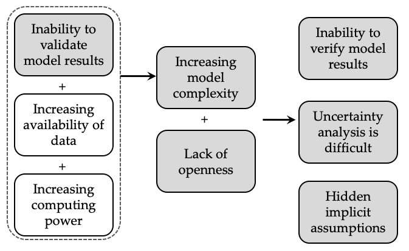
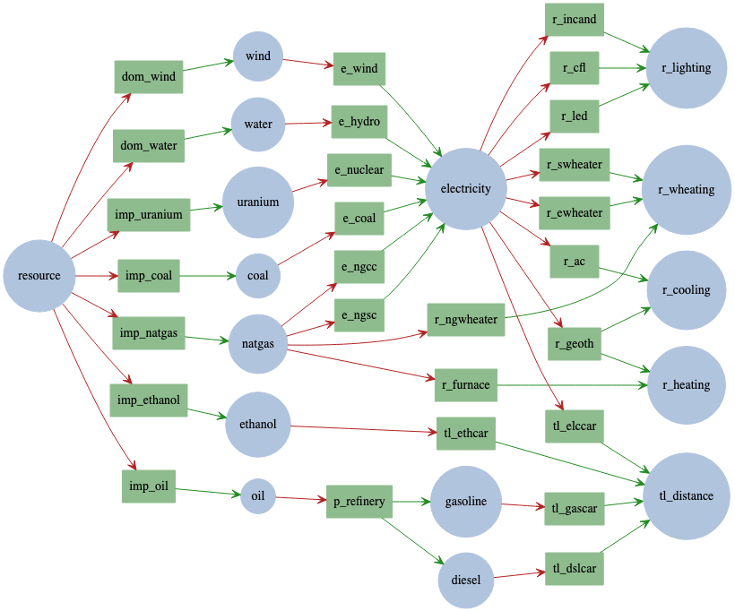
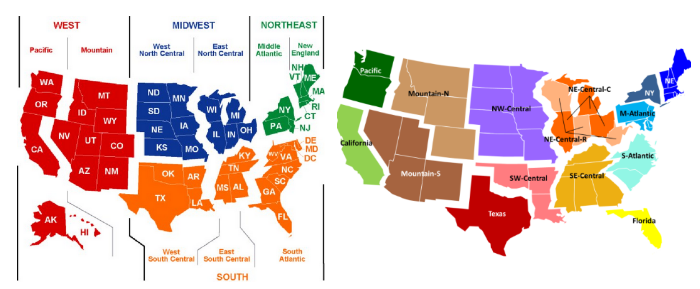

# Open Energy Outlook for the United States: A Roadmap

Joe DeCarolis, Paulina Jaramillo, Hadi Eshraghi, Evelina Trutnevyte, Anderson de Queiroz, Neha Patankar, Destenie Nock, Sonia Yeh, Daniel Johansson, David McCollum, Zhenhong Lin, Alan Jenn, Simi Hoque, Joon-Ho Choi, Yuyu Zhou, Soolyeon Cho, Joule Bergerson, Sauleh Siddiqui, Heather MacLean, Mohammad S. Masnadi, Gernot Wagner, Noah Kaufman, Gökçe Akın-Olçum, Christopher Galik, Eric Masanet, Colin McMillan, Karl Haapala, Timothy Gutowski, Bri-Mathias Hodge, Jeremiah Johnson, Dalia Patino-Echeverri, Michael Craig, Jesse Jenkins, Juha Kiviluoma, Amanda Smith

*Author biographies are available on project's [team page](https://openenergyoutlook.org/?page_id=12081).*

**Table of Contents**  
[1. Introduction](#1-introduction)  
[2. Research Objectives](#2-research-objectives)  
[3. Observed Limitations and Opportunities](#3-observed-limitations-and-opportunities)  
[4. Modeling Framework](#4-modeling-framework)  
[5. Spatio-Temporal Resolution](#5-spatio-temporal-resolution)  
[6. Characterizing Uncertainty](#6-characterizing-uncertainty)  
[7. Sector-Specific Modeling Considerations](#7-sector-specific-modeling-considerations)  
[8. Communication](#8-communication)  
[9. References](#9-references)  

## 1. Introduction
The [IPCC](https://www.ipcc.ch/sr15/) indicates the need to achieve carbon neutrality by 2050 in order to limit global average temperature rise to 1.5 degrees Celsius. Rapid and far-reaching global efforts focused on deep decarbonization will be required to achieve this target. Given past and present greenhouse gas emissions, the United States should play a lead role by decarbonizing its energy system. Appropriate action will require fundamental changes in the way we produce and consume energy and must be driven by climate-informed policy. Policy makers face the monumental challenge of crafting effective climate policy in the face of highly uncertain expectations about the future. The stakes are high because energy infrastructure is expensive and long-lived. Computer models of the energy system – referred to as energy system models – provide a way to examine future energy system evolution, test the effects of proposed policy, and explore the role of uncertainty. Model-based analysis can yield insights that inform the policy making process. Unfortunately, many of these computer models are opaque to outsiders and are used to run a few scenarios that produce limited insight ([DeCarolis et al., 2012](https://arxiv.org/ftp/arxiv/papers/2001/2001.10858.pdf)). Given the stakes associated with climate change mitigation, we must do better. Our project aims to bring energy modeling into the twenty-first century by applying the gold standards of policy-focused academic modeling, maximizing transparency, building a networked community, and working towards a common goal: examining U.S. energy futures to inform future energy and climate policy efforts.

## 2. Research Objectives
Energy modeling efforts should be driven by specific research questions. Within the United States, there is limited effort focused on modeling the whole energy system, including the technology and policy pathways required to achieve deep decarbonization. Thus, the research questions below
reflect a whole energy systems approach to deep decarbonization.

* **How do we define and measure deep decarbonization?** The term “deep decarbonization” is somewhat vague, and would benefit from a clear definition in order to set benchmarks for success. For the purpose of this document, “deep decarbonization” implies rapid and far-reaching efforts aimed at achieving economy-wide carbon neutrality by mid-century. It is important to consider factors outside of the energy system (e.g., agricultural emissions), which could affect overall emissions outcomes. For example, carbon neutrality in the United States might require net negative emissions from the energy system.
* **What policies allow us to achieve decarbonization cost effectively?** We should have a set of refined policy scenarios, rather than simply business-as-usual and a mitigation scenario. The modeled policies should be informed by political economy so we don’t end up with efficient but politically infeasible solutions. A useful output would be how different policy mechanisms affect model outcomes, including emissions and technology deployment, and which tradeoffs arise from different policies.
* **How does decarbonization affect equity and justice concerns?** Decarbonization consistent with a 1.5 or 2°C target will require vast transfers of wealth. How do we ensure that the resultant energy system is equitable and just? The model-based analysis should provide outputs that enable policymakers to evaluate the distributional consequences across different segments of society and between generations to better evaluate the equity implications of different policy mixes.
* **What technology pathways are possible under deep decarbonization?** This requires a broad focus on technologies across the energy system, including storage, power-to-gas, air-to-fuels, and technologies within the end-use sectors. Most carbon-free primary energy sources generate electricity, which requires increasing electrification of other energy sectors. It is important to capture technology pathways that cut across the energy system as well as inter-linkages and trade-offs among different sectors of the energy economy. This question is tightly coupled with the policy question, and can be used to look at a variety of scenarios, including 100% carbon neutral energy versus 100% renewables. It is also important to consider the level of regional heterogeneity in the results.
* **What is the role of demand-side measures?** While there tends to be a focus on supply-side options, it is important to consider how end-use demands can be reduced and managed through energy efficiency, behavioral changes, and demand-response.
How do we manage technology lock-in and stranded assets in light of future technology cost and performance uncertainty? Energy modeling can inform decisions on capital investment, plant retirement, and plant retrofits made under high uncertainty. We can apply existing methods to characterize future uncertainty and minimize the risk of technology lock-in.
* **What are the effects of potential large-scale natural and technological disruptions or other singular events?** Examples could include a deep global recession, fuel supply interruptions or gluts, major natural disasters, rapid advancement and deployment of autonomous vehicles, or severe climate impacts on the energy system.
* **How do we address future uncertainty affecting energy system development?** We need to identify major sources of uncertainty and quantify their effect on the different policy scenarios mentioned above. We also need to consider how uncertainty propagates through the system. For example, there is significant uncertainty associated with fuel supply and distribution, and it is important to consider how such uncertainty propagates through the system and affects the economics of downstream fuel use. Such uncertainty analysis can also inform data transparency regulations and prioritize future data collection, which over time can improve model accuracy.
* **What are the system-level inflection points that set technical limits or significantly increase the cost of deep decarbonization?** Using uncertainty analysis, we want to exercise the energy system model in order to identify policy- and technology-specific input assumptions – and their combinations – that produce inflection points in system cost or technology mix. 
* **What are the co-benefits or tradeoffs associated with deep decarbonization?** Because deep decarbonization efforts will require fundamental changes in energy supply and demand, it is important to consider how these changes can affect interconnected systems, including food, water,  and material supply chains. While the driving concern is reducing greenhouse gas emissions, how do we ensure a system that is reliable and resilient?
* **What role will international trade play in deep decarbonization?** For example, different international policy regimes and changing markets for energy commodities can have a significant impact on US deep decarbonization efforts.
* **What are the macroeconomic impacts of decarbonization?** Policy makers and other decision makers want to understand the implications of aggressive climate policy, including the generalized effects on the overall economy, as captured by gross domestic product and jobs. 

The questions above focus on policy-relevant modeling outcomes. These questions, in turn, motivate a large number of questions related to data and methods associated with the modeling process, which are broken down into several categories shown below.

Modeling Methods:
* How do we leverage existing datasets in an efficient way?
* How can predictive data science be brought to bear on energy system modeling?
* How can decision making under uncertainty be used to develop new policy relevant insights, and which particular methods should be used to characterize model sensitivity and uncertainty?
* How do we identify the variables and parameters that result in the most uncertain outputs of the model?
* In the long run, should we develop a short-term model validation exercise by reviewing recent editions of the OEO report and comparing against real world outcomes, and how can the resultant information be used to improve the model?

Modeled Impacts:
* Should we take into account broader economic impacts, like jobs and GDP impacts? If so, how?
* How can we integrate bottom-up LCA tools and assessments into the consideration of environmental impacts?

Model Dynamics:
* What is the appropriate spatial and temporal resolution to address the research questions above?
* What is the best way to model infrastructure retirement decisions beyond simply assuming fixed lifetimes?
* How can we model demand response and management in an energy system model?
* How can we better represent the uptake of new energy efficient technology in the end use sectors, beyond simple engineering economics?
* How do decision makers – including consumers, producers, and investors – respond to policy changes in the real-world, and how can this econometric information be incorporated into the modeling exercise?
* How can we model investor and consumer behavior to represent decisions about new infrastructure, retirements and retrofits?

Project Aims:
* How do we position this effort relative to other existing open source efforts?
* How do we communicate the usefulness of energy models as well as educate and manage expectations regarding their capabilities?
* What are the best ways to engage with the outputs of the model?
* In the long run, how do we ensure enough use, participation, and contributions to the project?

The questions articulated above are not meant to be comprehensive, but rather reflect the interests and priorities of the modeling team. In addition, addressing all the questions above is beyond the scope for this first phase of the effort. The research agenda will be prioritized based on further discussion.

## 3. Observed Limitations and Opportunities
We want this effort to be informed by a survey of the existing energy modeling landscape. Below we outline both limitations associated with ongoing modeling efforts, and the opportunities to address these limitations as part of this project.

### 3.1.  Limitations with Existing Efforts
Several limitations in existing US-focused energy system modeling efforts are articulated below. The Open Energy Outlook provides an opportunity to address many of these limitations by advancing the state-of-the-art in energy systems modeling.

* **Openness and transparency.** Most models are closed to third parties. When publicly available, they often lack transparency and are difficult to run. For example, the text below appears on [this EIA webpage](https://www.eia.gov/outlooks/aeo/info_nems_archive.php) with respect to [NEMS](https://www.eia.gov/outlooks/aeo/nems/documentation/), the model used to produce the Annual Energy Outlook:

    >The U.S. Energy Information Administration (EIA) developed the National Energy Modeling System (NEMS) primarily for its modelers to use it. As a result, only a few organizations other than EIA use NEMS. Past external users less familiar with NEMS programming and structure have reported that the system presents limitations and challenges.

* **Policy options.** There is a high degree of focus on carbon pricing rather than a broader range of policy tools. Model-based policy evaluations sometimes use unrealistic baselines without consideration of uncertainty, which can bias the results. There is also a lack of integration between global markets for energy commodities and international policy impacts. There is also little focus on equity and justice related to energy and climate policy. The research questions outlined in the previous section reflect a desire to address these gaps.
* **Model dynamics.** Existing efforts can suffer from too much dependency on economics, without sufficient consideration given to infrastructure, physics, social change, and political economy. Table 1 below provides some key examples.

**Table 1.** Limitations associated with energy model dynamics in existing efforts.

| Issue | Description |
| ----  |  ---------- |
| Market players | Most models do not adequately distinguish among key market players.   On the supply side, investors with different risk profiles play a role. Also, not enough consideration is given to end-use energy demands and customers, including the disruptive potential to reshape demand profiles with behind-the-meter distributed energy resources and storage. |
| Step changes | Models typically do not depict large step changes or shocks to the system – for example, in fuel prices, but rather assume smooth monotonic changes over time. |
| Innovation | Most models do not credibly depict innovation, particularly innovation induced by policy and the associated feedback with international markets and policies. |
| Buildings | There is a large disconnect between building energy simulators, which capture building-level thermodynamics, and energy system models that try to project energy investment and utilization in aggregate from buildings in the commercial and residential sector. |
| Electricity | In the electric sector, issues include the absence or insufficient representation of system operations under extreme penetrations of variable renewable energy (VRE), including low system inertia, voltage management, short-circuit power, ramping needs, diurnal and seasonal variability, and distribution grid bottlenecks due to electrification of heating and cooling, electric vehicles, and solar PV in buildings. Also, poor representation of retirement decisions, uncertainty in investment decisions, representation of fuel flexibility, and the reliability of infrequently run plants are also key concerns. |
| Fuel Supply | Many models make exogenous assumptions regarding the price and availability of fossil fuels, which can have a major impact on the model results. There is a need to model fossil fuels in more detail (e.g., bottom-up models that include the physics of fuel systems). International supply and trade of oil, natural gas, and biomass is also a key, but infrequently represented in energy system models. |
| Industry | The industrial sector is often oversimplified in energy systems models. Typically, only a few heavy industries are modeled explicitly and with limited technology options that often exclude important emerging process technologies.  There are many industry- or process-specific models in the engineering literature that are not taken up by energy systems models due to their complexity or structure incompatibilities. Industrial sector outputs (e.g., steel) are generally not linked to demand sectors (e.g., passenger vehicles) in energy systems models, which precludes endogenous demand modeling. |
| Transport | Inability to capture large disruptive change, such as connected autonomous vehicles (CAVs) and shared mobility options. |

There are also several limitations that across all sectors of the energy system, including the following:
* **Consideration of uncertainty.** There is too much focus on conventional scenario analysis, with an inadequate representation of uncertainty. Input data quality is unclear, and there has been little effort to formally assess data quality. Also little effort to apply methods that explicitly consider decision making under uncertainty.
* **Spatial and temporal resolution.** Many models lack spatially explicit projections, which becomes particularly important as we consider deep decarbonization scenarios that lead to large scale transformation of the energy system. Temporal resolution is also critical, particularly in the electric sector where low resolution can significantly bias the scenario results in which variable renewable resources and energy storage play a significant role.
* **Technology representation.** Renewables deployment across all sectors of the economy are often underrepresented; key low carbon technologies and pathways (e.g., power-to-X) are often lacking. There’s often an underrepresentation of energy-related infrastructure, including pipelines and transmission lines. In the industrial sector, technology characterization and the flexibility to adopt new technologies is lacking, there is too much aggregation of data to macro-sectors, and reporting on activity levels is lacking; in addition, the lack of material connections in the models prevent analysis of emerging strategies like materials efficiency and circular economy, which can reduce energy and resource demand. In addition to underrepresented technologies, there are also instances of overreliance on a particular technology. For example, many model-based analyses assume that large amounts of bioenergy with carbon capture and storage (BECCS) are available even though the technology is commercially unproven.
* **Sectoral integration.** Many modeling efforts analyze different sectors separately, or at most soft-link models. This lack of integration reflects siloed disciplines. Even energy system models that consider multiple sectors do not consider tradeoffs with enough granularity (e.g., lightweighting cars increases industry emissions but reduces vehicle emissions). 
* **Data management and availability.** Lack of unified vision regarding how to store, access, and manipulate energy data. A challenge to obtain and manage data at the individual machine and building level.

### 3.2. Opportunities
The limitations discussed in Section 3.1 provide an opportunity for this project to improve the process of energy system modeling. While it is beyond the scope of this effort to address all these limitations, we intend  to address them whenever possible. In addition to addressing the specific points above, the project should focus on the following broad outcomes.

First, the model and input data associated with the Open Energy Outlook should be publicly available, transparent, and easy to use. These three characteristics are related but distinct. Public availability implies that the model code and data are open source and publicly available online, allowing third parties to replicate the model-based analysis. Transparency goes beyond being open source – it means actively seeking ways to make the analysis and underlying model more comprehensible to others and replicable. Easy-to-use implies that users can get the model up and running quickly and easily. In addition, the model code should be modular so that it is straightforward to add and remove features from a particular model run.

Second, in order to be useful, the Open Energy Outlook needs to demonstrate how it adds value. Simply being open source and transparent is not enough. The added value can be in the choice of scenarios, policy options to examine, or methodological contributions; for example, how the application of uncertainty analysis lends new insights to policy discussions. Rather than focusing on numerical outputs, we should identify the broader narratives about key issues and inflection points that need more attention outside the academic community. High spatial resolution would allow the model to inform state-level policy, and provide tools for use by nonprofits, independent system operators, utilities, and public utilities commissions.

Third, this effort can help build a community around the relevant models and data while working on a common goal. This networked community can engage in meaningful debates, help push the boundaries of energy system modeling, expand awareness of energy modeling, and ensure this effort is sustained over time. Producing high quality, high visibility work during the initial 3-year project period will help attract more interest and attention from the broader energy modeling community. In addition, by making the modeling effort open source, transparent, and easy to use, we hope to attract more students and researchers interested in contributing to the modeling effort. Team members will look for supplemental funding to extend the work as well as opportunities to involve graduate students in the effort. 

In addition to the model-based analysis, this project can enhance community efforts associated with energy systems modeling in the United States by providing the deliverables listed below.

**Model outputs as input to other analyses.** Outputs in a digestible form can serve as input into other models. For example, model-based output can be used to construct marginal abatement cost curves (MACCs), which can serve as input into climate-economy models that estimate the social cost of carbon. Other forms of synthesized model output can be used to examine tradeoffs that inform other analyses.
**Input data repository for other modeling efforts.** There is a significant amount of duplicative effort involved in compiling input data for similar modeling efforts. Well-structured and well-documented input data can be made publicly available through the project website. In addition, low-level data (e.g., synthetic time series data) used to construct model inputs could also be made publicly available.
**Repository of vetted scenarios.** A set of well-conceived policy scenarios can serve as a starting point and benchmark for other model-based analyses.
**Recommendations for data standards.** We can highlight varying levels of data availability across sectors and geographical regions, which can be used to argue for increasing data availability within certain industry / academic communities. 

## 4. Modeling Framework
The Open Energy Outlook will utilize Tools for Energy Model Optimization and Analysis (Temoa), an open source energy system optimization model (ESOM). The Temoa formulation is similar to the [MARKAL/TIMES model generators](https://iea-etsap.org/index.php/etsap-tools/model-generators/times), [MESSAGE](https://iiasa.ac.at/web/home/research/researchPrograms/Energy/MESSAGE.en.html), and [OSeMOSYS](http://www.osemosys.org/). While Temoa has a similar methodological structure to these other models, its development was motivated by a strong desire to address limitations in the prevailing approach to model development and application shown in Figure 1. 

  
**Figure 1.** Causal model highlighting the limitations associated with the prevailing approach to energy model development and application. The three factors on the left side contribute to increasing model complexity, which combined with closed models, leads to the three negative outcomes on the right side. Temoa is designed to address the issues in gray.

Increased computing power coupled with increasing data availability have catalyzed the development of increasingly complex ESOMs. Furthermore, multi-decadal timescales for analysis prevent the timely comparison of model projections to real world outcomes, so the steady growth in model complexity remains unchecked by robust model validation exercises ([DeCarolis et al., 2012](https://arxiv.org/ftp/arxiv/papers/2001/2001.10858.pdf)). In the absence of publicly available source code and data, the models are black boxes to outside parties. The application of complex, opaque models leads to two negative outcomes: (1) an inability for third parties to verify published model results and (2) difficulty in performing uncertainty analysis.

Temoa was designed to address these limitations by instituting a transparent process for model development and application that facilitates independent third party verification as well as implementation of rigorous uncertainty analysis in a high performance computing environment. These features make it ideally suited to perform the analysis underlying the Open Energy Outlook for the United States. Compared to other modeling efforts, our objective is to keep the model formulation as simple as possible and as complex as needed, with the computational effort expended on sensitivity and uncertainty analysis. We think this is the appropriate approach when analyzing systems that have expansive system boundaries and a high degree of uncertainty. In addition, Temoa is easily extensible – the model formulation can be updated based on feedback from the expert community. For example, the basic formulation assumes fixed end use demands, but we have also implemented [a version with elastic demands](https://github.com/TemoaProject/temoa/tree/temoa_elastic).

### 4.1. Temoa Description
Like other ESOMs, Temoa represents an energy system as a process-based network in which technologies are linked together by flows of energy commodities (Figure 2). Each process is defined by an exogenously specified set of techno-economic parameters such as investment costs, operations and maintenance costs, conversion efficiencies, emission rates, and availability factors. 

  
**Figure 2.** Example network diagram created programmatically using the open source [Graphviz](https://graphviz.org/) program. Technologies (green boxes) are connected together in an energy system network by the flow of energy commodities (blue circles).

Temoa is formulated as a linear program that minimizes the total system cost of energy supply over the user-specified time horizon, subject to both system-level and user-defined constraints. System-level constraints include conservation of energy at the individual process level, the global balance of commodity production and consumption, and the satisfaction of end-use demands. User-level constraints include emission limits, maximum technology growth rates, and bounds on technology capacity and activity. Temoa minimizes the total system-wide cost of energy supply by optimizing the installation of new capacity and utilizing both new and existing capacity to meet demand over a user-specified time horizon that typically spans multiple decades. The time horizon is split into a user-defined number of time periods, which represent a bundled set of years. The results for each year within a given time period are assumed to be identical. To represent intra-annual variations in energy supply and demand, the model balances energy commodity flows across a set of user-defined time slices, which represent different combinations of seasons and times of day. There is no predefined limit on the number of time slices, but more time slices increase the computational requirements. The time slices are ordered to allow for the proper representation of renewables and storage across the modeled days.

The original algebraic formulation of Temoa is presented in [Hunter et al. (2013)](https://temoacloud.com/wp-content/uploads/2019/12/Hunter_etal_2013.pdf) with updates provided in the [online documentation](https://temoacloud.com/temoaproject/). ESOMs such as Temoa are formulated as linear programming problems in which continuous amounts of technology capacity are utilized to meet end-use demands. In cases where non-linear relationships exist, such as supply curves for primary energy commodities, a piecewise linear approach can be taken.

### 4.2. Temoa Software Elements 
Source code and datasets for Temoa have been [archived in GitHub](https://github.com/TemoaProject/) since 2011, and more recently, code and data used to produce specific analyses has also been [archived through zenodo](https://zenodo.org/communities/temoa/?page=1&size=20), which assigns document object identifiers (DOI) and serves as a permanent, publicly accessible electronic archive. However, we note that open source code and data represent necessary but insufficient conditions to ensure model transparency: a complex model with poor documentation is not transparent. In Temoa, we have documented the model through several means: a user manual, comments embedded in the source code, and the code itself consisting of descriptive variable names that provide self-evident meaning. In addition, we use [Sphinx](https://www.sphinx-doc.org/en/master/), which parses embedded documentation blocks in source code and automatically updates the user manual. Such an approach enables us to maintain consistency between code and documentation.

Temoa is implemented in [Python](https://www.python.org/) and utilizes Python Optimization Modeling Objects ([Pyomo](https://www.pyomo.org/)), an open-source software package developed at Sandia National Laboratory that supports a diverse set of optimization capabilities for formulating, solving, and analyzing optimization models. Using Python gives us access to a large ecosystem of libraries and packages that can be used to enhance model functionality. In addition to making the model source code and data publicly available, we have built Temoa using freely available, open source software elements in order to minimize the barriers to entry for new modelers. Examples of open source software elements include Python and Pyomo, used to construct the model; [SQLite](https://www.sqlite.org/index.html), used to store input and output data in a relational database management system; [Graphviz](https://www.graphviz.org/), used to construct network diagrams; and [Matplotlib](https://matplotlib.org/), used to generate output plots programmatically. Pyomo includes links to several solvers including [GLPK](https://www.gnu.org/software/glpk/glpk.html), which is open source. To minimize solution time, we typically use the proprietary [CPLEX](https://www.ibm.com/analytics/cplex-optimizer) solver, which is available at no cost under an academic license.

Temoa utilizes a relational database management system ([RDMS](https://www.codecademy.com/articles/what-is-rdbms-sql)) to organize input data. Various other input formats exist for sharing model data, including binary formats (e.g., HD5, NetCDF, XLS) and text formats (formatted ASCII, YAML, XML), but each is geared toward individual or archival data sets, rather than transparent comparison and global interoperability. An RDBMS is the most appropriate tool to archive and query common model data. The advantage over other storage options is that data stored in an RDBMS can be queried and mapped efficiently to a project's native input format. The relationships are defined through a schema and enforced by the RDBMS, which helps to eliminate errors in data entry. Through the schema, an RDBMS provides a declarative layer of access to the data: the user simply provides a descriptive definition of a model's data requirements in order to generate a model-specific dataset on demand. Another key benefit of an RDBMS is that it scales to very large datasets; for example, SQLite can handle databases up to [140 terabytes in size](https://www.sqlite.org/limits.html). 

**The model code and data are distinct elements of Temoa.** The model can operate on different [input databases](https://github.com/TemoaProject/data) representing distinct systems with different spatiotemporal characteristics. Several different input databases have been constructed for model-based analysis with Temoa. We have already constructed [a nine-region US database](https://github.com/TemoaProject/data/blob/master/US_National.sql), which will serve as the basis for the proposed Open Energy Outlook for the United States.

In addition, we use [Graphviz](https://www.graphviz.org/) to generate network diagrams representing the energy system. An example is shown in Figure 2. The capability to visualize the energy system network is critically important when building and debugging an input database. In addition, optimal installed capacity and commodity flows can be drawn from a model solution and superimposed on the network diagram.

Finally, we have developed an [outline portal](http://model.temoacloud.com/) that allows model users to upload their own database, generate the network diagram, run the model, make output plots, and download the model results as an Excel file. Video tutorials are also included. 

### 4.3. Other Modeling Projects
While Temoa will serve as the energy systems modeling platform, several modeling projects are being reviewed to help develop best practice guidance for this project. Model intercomparison projects, including the Stanford Energy Modeling Forum ([EMF](https://emf.stanford.edu/)) and the WCRP Coupled Model Intercomparison Project ([CMIP](https://www.wcrp-climate.org/wgcm-cmip)) demonstrate how different modeling teams can work together on a common objective. In the United States, the [US Mid Century Strategy for Deep Decarbonization](https://unfccc.int/files/focus/long-term_strategies/application/pdf/mid_century_strategy_report-final_red.pdf) produced by the Obama Administration and modeling efforts such as the NREL [ReEDS model](https://www.nrel.gov/analysis/reeds/), NREL Scalable Integrated Infrastructure Planning Project ([SIIP](https://github.com/NREL-SIIP/SIIPExamples.jl)), and the Global Change Assessment Model ([GCAM](http://www.globalchange.umd.edu/gcam/gcam-community/)) represent successful energy modeling efforts. The Deep Decarbonization Pathways Project ([DDPP](http://deepdecarbonization.org/)) is a global collaboration of different research teams charting deep decarbonization pathways. A large, parallel project in the Netherlands called [NEON](https://www.tue.nl/en/news/news-overview/12-12-2019-energy-transition-gets-major-boost-with-multimillion-grant/) seeks to develop a multidisciplinary research program to speed the transition to sustainable energy.

The Open Energy Modeling Initiative ([openmod](https://www.openmod-initiative.org/)) represents a network of international energy modelers committed to open source practices, and the [Wiki](https://wiki.openmod-initiative.org/wiki/Main_Page) provides a wealth of information and data pertaining to ongoing modeling efforts. A key issue is maintaining provenance over raw data, and the [SPINE project](http://www.spine-model.org/), part of the [EU Horizon 2020](https://ec.europa.eu/programmes/horizon2020/en) effort, is providing open source software to assimilate different datasets into model-specific input datasets. In addition, SPINE has the ability to execute complex workflows that include data processing and links between different models.

In other fields, the Community Earth System Model ([CESM](http://www.cesm.ucar.edu/)) and the Basic Local Alignment Search Tool ([BLAST](https://blast.ncbi.nlm.nih.gov/Blast.cgi)) represent successful community collaborations. Other projects funded by the Sloan Foundation are also of interest, including the [data visualization effort](https://www.urban.org/data-viz) by the Urban Institute and Macroeconomic Model Data Base ([MMB](https://www.macromodelbase.com/)), which archives different macroeconomic models based on a common computational platform.

[OSeMOSYS](http://www.osemosys.org/) and [MESSAGEix](https://github.com/iiasa/message_ix) are also well-known open source energy system models. It would be helpful to map out who is using these tools outside of the original model developers, and then trying to understand what factors contributed to new users adopting them. This could help us target the user base for this project.

## 5. Spatio-Temporal Resolution
Choosing the spatial and temporal resolution of the model is critical, and to a large measure defines the tradeoff between model granularity and computational performance. 

**Spatial resolution.** From a policy perspective, state-level modeling is ideal because the model can account for specific state-level policies. However, computational requirements—given the need to model the whole energy system at high temporal resolution—precludes the use of a state-level model in the short-term. To capture macroeconomic impacts, we could run CGE models at the state level and aggregate upward to the national or regional level (i.e., using [WiNDC](https://windc.wisc.edu/)). 

Regarding the electric sector, electricity flows by NERC regions, which do not neatly follow state boundaries. However, a number of models do assume regions as collections of states. For example, the EPRI [REGEN](https://eea.epri.com/models.html) model can be run with 14 regions (Figure 3). Modeling coal, natural gas and biomass supply across 14 regions should also be adequate, at least to start. With the light duty transportation sector, it might make sense to further disaggregate regional transportation demand into urban and rural components. 

  
**Figure 3.** The current version of the Temoa-compatible US database contains 9 regions, which follow the US Census Divisions (left). In this project, we will consider the 14 regions used by the EPRI REGEN model (right).

The current version of the Temoa database follows the 9 Census Divisions, so further splitting into 14 regions would require additional computational effort. Such a representation can capture major transmission and pipeline constraints as well as regional variations in renewable energy supply and end-use demands.

**Temporal Resolution.** The model’s temporal resolution is largely driven by requirements in the electric sector, which must consider hourly dispatch under high renewables penetration. We need multiple years of data to characterize seasonal and inter-annual variation. Our approach may require two-step iterative modeling to ensure computational tractability in the energy system model. The validity of models with only hourly resolution, especially under high renewable energy penetration scenarios, has been insufficiently explored and could be one useful direction for this work.

Hourly temporal resolution could be handled through sampling. We will experiment with sub-sampling of the year on the order of 10-20 weeks (or a sequence of several days) to ensure geographically consistent results, where capacity outcomes in specific regions are stable, not artifacts of the time periods sampled, and are a reasonably accurate representation of the full-year results if the full year could be modeled. The total number of sample time slices depends on the number of time varying wind, solar, hydro, and demand time series employed, and the desired geospatial accuracy. Getting accurate aggregated national-scale capacity and energy results is easier than getting accurate results within each region. We can explore this more, test improved sampling methods, and see if we can find ways to reduce the time series further. Temoa can be benchmarked against electricity models with high spatiotemporal resolution to determine which improvements are necessary.

## 6. Characterizing Uncertainty
Characterizing future uncertainty for robust policy making is a key element of the Open Energy Outlook. In energy systems modeling, a distinction is often made between parametric and structural uncertainties ([DeCarolis et al., 2017](https://www.sciencedirect.com/science/article/abs/pii/S0306261917302192)). Parametric uncertainties refer to uncertainty in the assumed values for model input parameters. Such uncertainties include cost projections for key technologies, assumptions pertaining to socio-economic developments, electricity load duration curves, charging patterns for electric vehicles, and cost and performance data for key industrial processes.

By contrast, structural uncertainties refer to the inability of the model to capture all of the critical real world dynamics that affect model outcomes of interest. At a high level, structural uncertainty originates from a couple sources. First, structural uncertainty is introduced when taking highly resolved spatio-temporal data and aggregating it to higher level representation suitable for an energy system model. For example, modeling the United States as a dozen regions neglects state-level dynamics and policies that could drive different results. Likewise, the temporal resolution can affect dispatch economics, and therefore the relative cost-effectiveness of different technologies, including renewables and grid storage. Second, there are a set of real world dynamics that are completely exogenous to the model. For example, a key source of structural uncertainty is the discrepancy between the model’s view of an omniscient social planner making cost minimizing decisions and the heterogeneity of real human behavior. Many energy system models do not explicitly account for political economy, differing risk preferences pertaining to large scale infrastructure investments, price response, or the multitude of factors affecting consumer purchasing and use decisions. Only limited work in the past has quantified how well such models approximate real world energy transitions. ([Trutnevyte, 2016](https://www.sciencedirect.com/science/article/abs/pii/S0360544216302821?via%3Dihub)).

Data availability can affect both parametric and structural uncertainties. It is important to consider the ways in which data is limited:
* **Irreducible uncertainties in data.** For example, the projected cost of solar photovoltaics over the next several decades is unknown to a high degree of precision. Capital cost projections are an example of parametric uncertainty: future costs are parameterized in the model, but their values will always be uncertain to some extent. 
* **Data is publicly available, but data quality is insufficient.** For example, price elasticities associated with U.S. commercial and residential heating demand are necessary to characterize the demand response to price. Published studies exist, but there are gaps and available data may not be representative of different consumer groups in different regions.
* **Critical data are nonexistent or proprietary.** For example, data on the natural gas distribution network is nonexistent or proprietary in many cases. Given the lack of data, a highly stylized natural gas distribution network introduces a structural uncertainty into the model.

As part of the data development process, we will work to establish a protocol to score data based on its origin, publication date, and presumed quality. Such data characterization can help inform priorities for data development. We need to prioritize where we can improve the projections with better data and model dynamics, and where uncertainty analysis is required to generate insight in the face of irreducible uncertainties. All model-based results must be interpreted in light of this future uncertainty. 

It is also a challenge to keep pace with new datasets as they become available, though [OpenEI](https://openei.org/wiki/Main_Page) and the Danish Energy Agency’s [Technology Data repository](https://ens.dk/en/our-services/projections-and-models/technology-data) have catalogued publicly available data suitable for energy models. We also need to make sure that the input data does not become too dated and thus lead to inaccurate projections. 

There are a variety of ways that uncertainty can be assessed. To understand the influence of particular input parameters on model outputs of interest, bounding analysis, parametric sensitivity analysis, Method of Morris, and Monte Carlo simulation can be applied. All of these methods allow modelers to introspect the model and determine how variations in one or more input values affect key outputs, such as technology deployment levels, cost, and emissions. In cases where the analysis is driven by the need to develop a decision making strategy in the face of future uncertainty, then belief dominance, stochastic optimization, robust optimization, and robust decision making (RDM) are options. Structural uncertainty can be addressed by applying model-to-generate alternatives (MGA) and performing sensitivity analysis on model features. Methods to assess parametric uncertainties analysis are provided in Table 2, and methods to assess structural uncertainties are given in Table 3.

The choice of methods to employ in the Open Energy Outlook should be driven by the particular research questions we plan to address. In addition, there must be a compromise between the computational performance of the model and the type of sensitivity and uncertainty analysis that can be applied. For example, a system with a high spatio-temporal resolution may limit the application of computationally intensive methods such as stochastic optimization. In addition, we need to consider our target audience for the report. It may make sense to present simpler forms of uncertainty analysis in the main report, and save more detailed analysis for journal papers.

**Table 2.** Methods to assess parametric uncertainties

| Method | Comments |
| ------ | -------- |
| Scenario analysis | Scenario analysis is the most common approach to presenting results from energy system models, but it can give a misleading impression of large underlying uncertainties.
Bounding analysis | Bounding analysis simply assumes high and low values for given parameters to set bounds, which can be used in the model to observe the effects. (A recent example by [Schweitzer and Morgan, 2016](https://www.sciencedirect.com/science/article/pii/S0040162515002632) is applied to US electricity demand projections by 2050.)|
|Belief dominance | Belief dominance is focused on making decisions under uncertainty while incorporating different stakeholder beliefs and values. Stakeholders have conflicting beliefs about the future state of the world. The goal of belief dominance is not to find the “optimal” solution, but to find the set of “not bad” solutions that create a common ground among stakeholders. This approach can help capture how our policy results and analysis change under different cost scenarios and stakeholder values. (See [Baker, Bosetti, and Salo, 2016](https://papers.ssrn.com/sol3/papers.cfm?abstract_id=2815365)) |
| Parametric sensitivity analysis | Vary model input values one-at-a-time and observe how outputs of interest change. |
| Method of Morris | Method of Morris is a global sensitivity analysis method that can be used to identify the model inputs that produce the largest effect on model outputs of interest. The method produces a reliable sensitivity measure with a minimum number of runs and can handle a large number of uncertain parameters, making it suitable for use with data-intensive energy models. (See [Usher, 2016](https://discovery.ucl.ac.uk/id/eprint/1504608/); [Eshraghi, 2018](https://arxiv.org/abs/1912.05679)) |
| Monte Carlo simulation | Monte Carlo simulation can be used to test a large number of variations in input parameter values in order to observe the spread and distribution in outputs of interest. (See [Eshraghi, 2018](https://arxiv.org/abs/1912.05679)) |
| Robust Decision Making (RDM) | RDM starts with a limited number of proposed policies, which are then simulated over a wide range of plausible future states. Statistical clustering techniques can then be applied to identify regions of the decision space where the proposed policies perform particularly well or poorly. The objective is to find policy solutions that are robust under a wide range of conditions rather than an “optimal” one under a very limited set of assumptions. (See [Groves and Lempert, 2007](https://www.sciencedirect.com/science/article/abs/pii/S0959378006000896)). |
| Stochastic optimization | Stochastic optimization typically optimizes the expected value of the objective function. It embeds future uncertainty into a scenario tree, where each branch of the tree is assigned a subjective probability and a value for the uncertain parameter(s). Optimization over the entire tree yields a near-term decision strategy that hedges against future uncertainty. (For example, see [Patankar et al., 2019](https://www.sciencedirect.com/science/article/pii/S0973082618305878)). |
| Robust Optimization | Robust optimization seeks solutions across a set of worst-case parameter values. A key advantage of robust optimization over stochastic optimization is that it does not suffer from the curse of dimensionality. (See [Patankar, 2019](https://repository.lib.ncsu.edu/bitstream/handle/1840.20/36943/etd.pdf?sequence=1)) |
| Scenario discovery | Scenario discovery aims to identify combinations of model assumptions that are associated with meeting or missing a predefined policy target. (See [McJeon et al., 2011](https://www.sciencedirect.com/science/article/pii/S0140988310001866?via%3Dihub)). |

**Table 3.** Methods to assess structural uncertainties

| Method | Comments |
| ------ | -------- |
| Modeling-to-Generate-Alternatives (MGA) | MGA can help address structural uncertainties by systematically searching the model’s near optimal space for alternative solutions that are maximally different in decision space. (See [Trutnevyte 2011](https://www.sciencedirect.com/science/article/abs/pii/S0360544216302821?via%3Dihub); [DeCarolis et al., 2016](https://arxiv.org/ftp/arxiv/papers/1912/1912.03788.pdf)). |
| Sensitivity analysis | Sensitivity analysis can be applied to test variations in the model formulation; for example, with and without elastic demands. Such sensitivity analysis can help elucidate the importance of particular model features and also generate insights that are robust to variations in the formulation. |
| Model benchmarking | The energy system models can be benchmarked against more detailed sector-specific models to see how variations in model structure and input data affect key sectoral outcomes. Multi-model comparisons are also instructive, and the [Stanford Energy Modeling Forum](https://emf.stanford.edu/) specializes in such work. |

There are several sector-specific uncertainties, which are detailed below in Section 7 below. In addition, the system-wide uncertainties shown below should also be considered.

**Time series supply and demand data.** Within Temoa, we need to represent end-use service demands across the energy system, not just electricity demand. Hourly load profiles for buildings, vehicles, and industry are lacking. Multiple years of hourly chronological time series data for wind, solar, hydro, and demand all for a coincidental weather year is also a challenge.

**Technology cost projections.** Technologies with rapidly changing costs, such as solar PV, electric vehicles, and storage, or potentially large volatility in fuel prices, such as natural gas and oil, introduce uncertainty into the model projections. Given the data-intensive nature of the model, it can be challenging to keep up with cost projections that can change on a quarterly basis. 

**Long duration storage.** A challenge with energy system models is the representation of storage. Long duration storage, which includes hydrogen, compressed air, and hydro, is often viewed as a key element of low carbon systems. Representing such long duration storage in time sliced or chronological energy system models with only a sampling of days is challenging and may not present a fully accurate picture of its performance.

**Consumer preferences.** Consumer preferences for system level transitions are largely unknown. While some data exists, there is a dearth of data regarding preferences for specific technologies and combinations of technologies. A more detailed accounting of consumer preferences (i.e., beyond hurdle rates and elasticities) would require structural changes to the model. 

**Data for uncertainty quantification.** For many uncertain assumptions and parameter values, we lack the data to properly characterize probability distributions and obtain sample scenarios associated uncertainty parameters. Thus models have limited ability to represent correlated effects among variables and to quantify realistic confidence intervals on the solutions.

**Policy.** While the proposed analysis will focus on US federal policy, additional policies and regulations at the state or local level can also drive bottom-up changes in the system that are not well-captured. Temoa also currently does not capture considerations related to equity and justice. Policy considerations related to political economy could be addressed exogenously through careful selection of policy options to analyze. Equity and justice can be addressed through different scenarios and ex post analysis of model results. Overall, wide-reaching policy can be treated via scenario analysis, while smaller scale policy options can be handled as part of the uncertainty analysis.

## 7. Sector-Specific Modeling Considerations
Given the complexity of the US energy system, it is important to consider specific issues within each modeled sector. Below we discuss each sector, including key modeling elements, relevant data sources, and uncertainty considerations.

### 7.1.   Electricity
**Key Modeling Elements.** It is important to capture the dynamics associated with a high renewables penetration in the electric sector, as this is seen as one of the central elements in a decarbonized energy system. To that end, several features are required to ensure that the electric sector is accurately modeled. Features are discussed in rough order of priority. First, end-use demands and electricity supply must be modeled chronologically in order to properly model storage, demand response, and ramping. Modeling every hour of the year is too computationally intensive, so we will sample time periods that capture the range of future system conditions. Second, given the value of geographic smoothing and balancing area expansion, sites with diverse wind and solar resources should be available for development.  Third, direct air capture (DAC) and bioenergy with CCS (BECCS), negative emission technologies widely deployed by integrated assessment models, must be integrated as electricity sector components, as they will function as large consumers and producers, respectively, of electricity. Fourth, inter-regional natural gas and electricity transfer capacity expansion should be implemented. Fifth, the model needs an improved representation of retirement and extensions of existing plants based on operating revenue instead of vintage. Sixth, the model should consider integration with the Canadian power system, as the Northeast imports power and cap-and-trade systems will likely merge. Seventh, the model should consider the possibility to repower coal capacity with natural gas. In the long-term, we should also consider intra-zonal spur line transmission costs included in the capital costs and additional regions based on data and transmission limitations.

**Data Sources.** [GenX](https://tlo.mit.edu/technologies/genx-configurable-capacity-expansion-model) as well as [PowerGenome](https://github.com/gschivley/PowerGenome), which can be used to map primary data from [PUDL](https://catalyst.coop/pudl/) into our modeling framework. The [NREL ReEDS](https://www.nrel.gov/analysis/reeds/) model was recently open sourced and can provide valuable data. [IPM](https://www.icf.com/technology/ipm) also has a stylized representation of transmission. [ARPA-E Grid Data](https://arpa-e.energy.gov/?q=arpa-e-programs/grid-data) datasets may also provide useful data.

**Uncertainty Considerations.** Primary data on transmission system constraints is hard to get. This lack of data means that models may underestimate interconnection costs and congestion effects. There is also significant uncertainty associated with projected technology costs, which can be addressed with the parametric sensitivity methods discussed in Section 6. Belief dominance can be applied since there is disagreement about the projected cost of key generating technologies, including nuclear and solar.

Among all sectors, the electric sector is likely the most sensitive to the choice of spatiotemporal resolution, which can have a significant effect on dispatch economics, and therefore investment choices for variable  renewables and storage. The eventual choice of spatiotemporal resolution is a key structural issue. Benchmarking Temoa results against a more granular electric sector model will be key.

### 7.2. Buildings
**Key Modeling Elements.** It is important to capture variations in building stock by region, including building typology, building height (i.e., ratio between façade area and volume), retrofit and refurbishment indices, and climate zone. It would also be useful to capture differences in building growth and expansion rates by modeled region. We could also consider climate change feedbacks on energy demand. It is also important to consider how building occupants might respond to variations in energy prices or other signals, and how that might reshape demand. Overall, we need to find ways to construct a bottom-up representation of buildings that can be aggregated up to the regional level. The model should consider equipment upgrades (e.g., HVAC, lighting systems), improvements in the building envelope to increase thermal efficiency, characteristics of new building stock, and how individuals might respond to various signals or incentives.

Building data with hourly resolution is necessary to characterize building performance and interact with other modeled sectors. The building team can start with high resolution data to draw insights about differences between urban and rural regions, different municipal regions, different demographic categories and aggregate up to the appropriate regional level within Temoa. It is possible to build demand profiles for hourly end uses in different types of buildings without having to model each building. This approach is not trivial, and would require the development of a separate model that focuses specifically on the building sector that would allow us to downscale to the temporal resolution needed and then upscale to the spatial resolution used in Temoa. 

**Data Sources.** Data sources include ([CBECS](https://www.eia.gov/consumption/commercial/)) and PNNL data. Also, [Waite and Modi (2020)](https://www.sciencedirect.com/science/article/abs/pii/S2542435119305781) construct US census-tract level hourly building heating demand profiles from underlying weather data and building stock information. Methods are described in the paper and the underlying data is available [here](https://academiccommons.columbia.edu/doi/10.7916/d8-4g8y-mv98). Perhaps something similar can be done for cooling demand. We could also consider the [EnergyPathways model](https://github.com/energyPATHWAYS/EnergyPATHWAYS) from Evolved Energy Research. It is a projection model (i.e., no optimization), and we may be able to mine it for building demand data. Finally, PNNL’s Building ENergy Demand ([BEND](https://im3.pnnl.gov/model?model=BEND)) model could potentially be used to characterize building electricity demands at the appropriate spatiotemporal scale.

**Uncertainty Considerations.** Existing building energy models are bottom-up with fine temporal and spatial resolution. There is a disconnect between such building energy performance modeling and the aggregate scale required for an energy system model, though some efforts, including [Rasku and Kiviluoma (2019)](https://www.mdpi.com/1996-1073/12/1/5) and the development of the [BEND model](https://im3.pnnl.gov/model?model=BEND) help to bridge the gap. Factors to consider with buildings include climate feedbacks, occupant behavior, code adoption, building retrofits, equipment upgrades, building age, building control strategies, and the use of buildings for distributed generation and storage.

Structural  uncertainty is introduced by scaling up results at the individual building level to the regional level required by an energy system model. The eventual aggregated representation will either neglect or average over effects associated with climate and microclimate, building floorspace growth, building occupant behavior and occupancy schedules, HVAC modernization efforts, building envelope degradation and refurbishment, design variation, and operation schedules.

Parametric uncertainty includes cost and efficiency of building equipment over time, distribution of aggregated building-related service demands over the course of a year, and assumed response of building occupants to price signals. The importance of these parameters can be assessed using the methods described in Section 6.

### 7.3. Fuel Supply 
**Key Modeling Elements.** The granularity of natural gas timesteps and the distribution system should be considered. Natural gas supply is becoming more interdependent with electricity systems as time goes on, and is going to play a role in distributed energy systems. Linear programming models such as Temoa are not enough to model the processes required for fuel production and processing, along with new technologies. We need a way to link with more detailed process models or incorporate nonlinearities. There is a need to balance the representation of fuels and electricity, where the latter often receives more attention. Given the challenge of data uncertainty associated with fuel supply, it is important to acknowledge the different magnitudes and types of data uncertainty.

Crude oil and natural gas are heterogeneous in terms of production and refining life-cycle GHG emissions, and regional emission factors should be considered in the model.   

**Data Sources.** There is some publicly available data, but it is limited. Commercially available data can fill many gaps, but using them within an open source model raises significant concerns. Publicly available resources include The Oil Production Greenhouse gas Emissions Estimator ([OPGEE](https://eao.stanford.edu/research-areas/opgee)), EIA, USGS, [GREET](https://greet.es.anl.gov/), [NREL ReEDs](https://www.nrel.gov/analysis/reeds/), the Petroleum Refinery Life Cycle Inventory Model ([PRELIM](https://www.ucalgary.ca/lcaost/prelim)), [GCAM-USA](http://www.globalchange.umd.edu/data/annual-meetings/2018/Iyer_GCAM-USA_Overview_20181016.pdf). Commercial datasets include [Oil and Gas Journal Statistics](https://www.ogj.com/industry-statistics), [Wood Mackenzie](https://www.woodmac.com/), [Rystad Energy](https://www.rystadenergy.com/), [IHS Markit](https://ihsmarkit.com/index.html), and [RBAC](https://rbac.com/).

**Uncertainty Considerations.** There is a lack of time series data associated with granular nodal prices in natural gas markets. Publicly available oil and gas upstream production data from EPA and USGS are poor quality. Demand for industrial fuels is very uncertain. Information about fuel quality, including crude oil assays and natural gas additives, are lacking. Gaps exist in biofuel data, including land use, modeling of renewable identification numbers (RINs), and technology cost and performance data. Fossil fuel co-products, which are very important for profitability studies of fossil fuels (e.g., helium production from natural gas, natural gas liquids from shale gas) should be considered. Policies and regulations, which vary by fuel, also affect prices and availability. International trade is a key determinant of fuel prices, and we need to consider how to address this limitation given that the model’s input dataset is US-focused.

These data limitations contribute to both structural and parametric uncertainty. For example, the inability to model natural gas distribution infrastructure with high spatiotemporal resolution affects model structure. Most other data limitations represent parametric uncertainty, which can be addressed with methods described in Section 6. We need to wrestle with improving data quality with proprietary sources versus using public sources and doing additional sensitivity analysis.

### 7.4. Industry 
**Key Modeling Elements.** It will be critical to understand and model the variety of energy sources used throughout industry, as well as the key subsectors and process technologies that consume energy. Currently, the sector is largely served by the combustion of natural gas and process byproducts, and electricity, as well as significant consumption of oil as a product feedstock. In addition,  other fossil- and non-fossil-based energy sources supply manufacturing processes. The influence of energy sources and process technologies on decarbonization will need to be carefully considered to develop accurate projections, especially with regional considerations. In the longer term, it would be useful to better capture interactions with other sectors through material and energy flows, rather than just the latter. Key longer-term decarbonization strategies can include electrification, renewable process heat, hydrogen feedstocks, and materials efficiency strategies, all of which will require additional technology resolution. Additionally, endogenous modeling of materials demand is important for understanding how mitigation strategies in other sectors may affect industrial demand; for example, massive expansion of renewables or negative emission technologies (e.g., direct air capture) may increase the demand for steel produced domestically or abroad. For endogenous demand modeling linked by materials flows, it will be necessary to capture life cycle energy use and emissions with consistent system boundaries.

**Data Sources.** Available datasets include the following: EIA Manufacturing Energy Consumption Survey ([MECS](https://www.eia.gov/consumption/manufacturing/data/2014/)), [Carbon Disclosure Project reports](https://www.cdp.net/en), DOE Industrial Assessment Centers ([IACs](https://iac.university/download)), [EPA sector notebooks](https://archive.epa.gov/compliance/resources/publications/assistance/sectors/web/html/index-3.html), US Census Bureau [Economic Census](https://www.census.gov/programs-surveys/economic-census.html), USDA [Census of Agriculture](https://www.nass.usda.gov/AgCensus/), DOE [CHP database](https://doe.icfwebservices.com/chpdb/), NREL [county-level energy balances](https://github.com/NREL/Industry-energy-data-book), and [NIST unit process models](https://www.nist.gov/publications/incorporating-unit-manufacturing-process-models-life-cycle-assessment-workflows). [NAICS codes](https://www.naics.com/search-naics-codes-by-industry/) provide a convenient structure for mapping US industry; key top-level sectors include: 11-Agriculture, Forestry, Fishing, and Hunting; 21-Mining; 23-Construction; and 31-33-Manufacturing. Manufacturing is arguably the most important energy-consuming sector, and is further subdivided into major energy consuming subsectors, including iron and steel, cement, chemicals, pulp and paper, and food processing.  

**Uncertainty Considerations.** Highly resolved (temporal, spatial, operational) energy data is lacking. Published MECS survey data for industrial subsectors is limited; there is no systematic and comprehensive accounting of technology penetration and vintages; few subsectors report physical production levels; the energy use characteristics of large and small plants are not differentiated; and production of materials and products are disconnected from their use by other economic sectors. Modeling technology adoption in industry is hindered by lack of data on the cost and performance characteristics associated with current technology stocks as well as new and emerging technologies. Also, there is an overall poor characterization of the energy use and equipment of non-manufacturing industrial sectors (i.e., agriculture, mining, and construction). In addition, careful collection of energy use data is not widespread across industrial sectors and many companies are reluctant to share data. Analyses of mitigation pathways often must make many simplifying  assumptions that may not represent how industrial companies operate. Thus industrial energy models are inherently uncertain, and future modeling efforts will need to involve industry experts for validation.

Structural uncertainties are introduced by having an overly simplified representation of some industrial subsectors due to a lack of data. Additional structural uncertainty stems from industrial energy demands that are disconnected from material demands across the US economy and internationally. Parametric uncertainty can be reduced by mining existing data sources, and the remaining uncertainty addressed with the methods listed in Section 6.

### 7.5. Transportation
**Key Modeling Elements.** We need to account for heterogeneity in private transport behavior. Additional factors to consider in transportation include the role of autonomous vehicles and transportation network companies (TNCs), light duty battery electric vehicles, as well as low carbon options in marine, aviation, and other forms of heavy duty transportation. TNCs and mode choice can be based on exogenous assumptions. We should include a linearized vehicle choice model in order to better capture vehicle purchasing patterns. Given the potential importance of power-to-gas under deep decarbonization, representation of hydrogen infrastructure should be included, including economics of scale and reductions in refueling inconvenience over time.

**Data Sources.** Several models and data sources are available, including the following: Market Acceptance of Advanced Automotive Technologies ([MA3T](https://teem.ornl.gov/ma3t.shtml)), the National Household Transportation Survey ([NHTS](https://nhts.ornl.gov/)), Freight Analysis Framework ([FAF](https://ops.fhwa.dot.gov/freight/freight_analysis/faf/)), and the DOE total cost of ownership study, which is ongoing. With respect to alternative vehicle infrastructure, the Electric Vehicle Infrastructure Projection Tool ([EVI-Pro](https://afdc.energy.gov/evi-pro-lite)) and DOE Hydrogen Analysis Project ([H2A](https://www.hydrogen.energy.gov/h2a_analysis.html)) should be investigated. There is also new mobility data available on  TNC, scooters, and bicycles, as well as associated data standards including the General Bikeshare Feed Specification ([GBFS](https://apievangelist.com/2016/09/13/the-general-bikeshare-feed-specification/)), Mobility Data Specification ([MDS](https://slate.com/business/2019/04/scooter-data-cities-mds-uber-lyft-los-angeles.html)).

**Uncertainty Considerations.** Key uncertainties include the projected costs of vehicles and vehicle components (e.g., batteries, fuel cells) over time. With regard to electric vehicles, a key issue is the timing associated with charging. Data on commercial vehicle costs and high resolution empirical demand is lacking. Data pertaining to transportation network companies (TNCs) (e.g., Uber, Lyft) as well as connected and automated vehicles (CAVs) are also lacking. We also lack data pertaining to heavy duty road transportation, aviation, shipping. Low carbon options are a particular issue. Parametric uncertainties can be addressed with better data and the use of the uncertainty methods described in Section 6.

Modeling modal selection, vehicle choice, acceptance of ride sharing and autonomous vehicles extend beyond simple least-cost optimization and impose challenges. Structural uncertainties are associated with the selection of different transportation modes and vehicle types, as well as consumer behavior. There are also uncertainties associated with the distinction between urban and rural mobility infrastructure, for example with regard to hydrogen refueling and vehicle charging. The role of autonomous vehicles and ride sharing is important, and its ultimate effect on demand for passenger-miles traveled is uncertain. Some of these structural uncertainties could be addressed by performing sensitivity analysis with and without different model features, such as the use of a consumer choice model.

### 7.6. Policy Considerations 
The modeling effort should consider a wide range of policies, from a carbon tax to Green New Deal-style policies. It should be possible to represent a wide range of policy mechanisms, both economy-wide and sector-specific. Policy options should be developed to incorporate some aspects of governance drivers and the winners and losers of the energy transition. We should also consider ways to model policy impacts, including investment into infrastructure, that include factors beyond simply price and the levelized cost of energy (e.g., political will). When developing scenarios to model, we need to be explicit about conservative versus aggressive policy scenarios.

A couple cross-cutting model elements should also be considered. First, given the complexity of the US energy system, the energy system model should be benchmarked against sector-specific models in order to validate key results. Second, rather than considering a single omniscient social planner that optimizes all decisions based on least-cost, we should explore ways to consider different market actors, such as consumers and suppliers. Also, important to consider the heterogeneity in consumer behavior as it relates to demand response and end-use technology adoption.

## 8. Communication
The ultimate goal of this modeling project is to influence public policy using well-conceived and rigorous model-based analysis. To do so, we need to think strategically about communication that can help build our community and reach decision makers in government and industry. Building public support can also attract additional funding that can help ensure the long-term sustainability of this effort. The opportunities below can be used to outline grand challenges, discuss the role of model-based analysis, provide updates on what our new community is doing, and discuss key model insights.

**Public communication.** Social media, particularly Twitter,  is an effective means to communicate with the broader energy systems modeling community about data, methods, and results. Short explanatory blog posts, like [this one](https://genr.eu/wp/modeling-low-carbon-energy-futures-for-the-united-states/), can also help spread the word. Outlets such as [LinkedIn](https://www.linkedin.com/) and [EnergyCentral](https://energycentral.com/) could work well for such posts. Op-eds in major newspapers, like [this one](https://www.nytimes.com/2019/09/19/opinion/climate-change-12-years.html), can help to reach a very broad audience. Articles in [The Conversation](https://theconversation.com/us) allow us to work with professional editors and communicate key elements of the project. Discussion with journalists, including via social media, can help increase visibility as well. A YouTube channel with short videos explaining key outcomes and model graphics would be helpful. For example, [here](https://www.bp.com/en/global/corporate/energy-economics/energy-outlook.html) is one produced by BP as part of the BP Energy Outlook.

**Academic communication.** An objective of the project is to produce a journal special issue that investigates several modeling-related issues in more depth. In addition, perspectives or commentaries in journals such as [Nature](https://www.nature.com/), [PNAS](https://www.pnas.org/), [Nature Energy](https://www.nature.com/nenergy/), [Nature Climate Change](https://www.nature.com/nclimate/), [Science](https://www.sciencemag.org/), or [Joule](https://www.cell.com/joule/home) can help communicate to a broader academic audience. Special sessions at conferences can also be a way to communicate the results to an academic audience, including [AGU](https://www.agu.org/), [IEW](http://www.internationalenergyworkshop.org/), [IAEE](https://www.iaee.org/en/conferences/), [INFORMS](https://www.informs.org/), [ISSST](https://issst.net/), and [ACEEE](https://www.aceee.org/events). Since we’re building a public list via [groups.io](https://oeo.groups.io/g/main), we could also advertise and deliver a webinar detailing key results to folks on the list. Recorded webinars could also be posted on the [project website](https://openenergyoutlook.org/). Once we start producing papers, we can also create a preprint archive via [ArXiv.org](https://arxiv.org/) or post items to [ResearchGate](https://www.researchgate.net/). Email updates to relevant communities, like [openmod](https://www.openmod-initiative.org/), can help keep other modelers abreast of our efforts. As a team, we will also work collectively to find opportunities to expand the modeling exercise and recruit new researchers who can contribute to model development and application. Such outreach to new participants will help ensure the long-term success of the effort.

**Policy Makers and Industry.** Policy memos can be used to communicate with Congressional as well as DOE and EPA staff. Workshops targeting government offices as well as policy think tanks could be an effective means to communicate key results as well as provide instruction on modeling tools.  Would also be helpful to engage with groups such as [ESIG](https://www.esig.energy/) to get utility perspectives. Private briefings can also be given upon request.

## 9. References

Baker E, Bosetti V, Salo A. Finding common ground when experts disagree: Belief dominance over portfolios of alternatives. FEEM Working Paper No. 46.2016. Available at: https://papers.ssrn.com/sol3/papers.cfm?abstract_id=2815365##

DeCarolis JF, Hunter K, Sreepathi S, 2012. The case for repeatable analysis with energy economy optimization models. Energy Economics, 34(6): 1845-1853.

DeCarolis J, Daly H, Dodds P, Keppo I, Li F, McDowall W, Pye S, Strachan N, Trutnevyte E, Usher W, Winning M, 2017. Formalizing best practice for energy system optimization modelling. Applied Energy, 194: 184-98.

DeCarolis JF, Babaee S, Li B, Kanungo S, 2016. Modelling to generate alternatives with an energy system optimization model. Environmental Modelling & Software, 79: 300-310.

Eshraghi H, de Queiroz AR, DeCarolis JF, 2018. US energy-related greenhouse gas emissions in the absence of federal climate policy. Environmental Science & Technology, 52(17): 9595-95604.

Groves DG, Lempert RJ, 2017. A new analytic method for finding policy-relevant scenarios. Global Environmental Change, 17(1): 73-85.

Hunter K, Sreepathi S, DeCarolis JF, 2013. Modeling for insight using tools for energy model optimization and analysis (Temoa). Energy Economics, 40: 339-349.

McJeon HC, Clarke L, Kyle P, Wise M, Hackbarth A, Bryant BP, Lempert RJ, 2011. Technology interactions among low-carbon energy technologies: what can we learn from a large number of scenarios?. Energy Economics, 33(4): 619-631.

Patankar NS. Addressing Uncertainty in Energy System Optimization Models Over a Long Planning Horizon. PhD thesis, NC State University. Available at: https://repository.lib.ncsu.edu/bitstream/handle/1840.20/36943/etd.pdf?sequence=1&isAllowed=y

Patankar N, de Queiroz AR, DeCarolis JF, Bazilian MD, Chattopadhyay D, 2019. Building conflict uncertainty into electricity planning: A South Sudan case study. Energy for Sustainable Development, 49: 53-64.

Rasku T, Kiviluoma J, 2019. A comparison of widespread flexible residential electric heating and energy efficiency in a future nordic power system. Energies, 12(1): 5.

Schweizer VJ, Morgan MG, 2016. Bounding US electricity demand in 2050. Technological Forecasting and Social Change, 105: 215-223.

Trutnevyte E, 2016. Does cost optimization approximate the real-world energy transition? Energy, 106:182-193.    

Usher, W, 2016. The Value of Learning about Critical Energy System Uncertainties, An exploration of dynamic uncertainty in the energy system. PhD thesis, University College London. Available at: https://discovery.ucl.ac.uk/id/eprint/1504608/. 
Waite M, Modi V, 2020. Electricity Load Implications of Space Heating Decarbonization Pathways. Joule, 4(2): 376-394.

